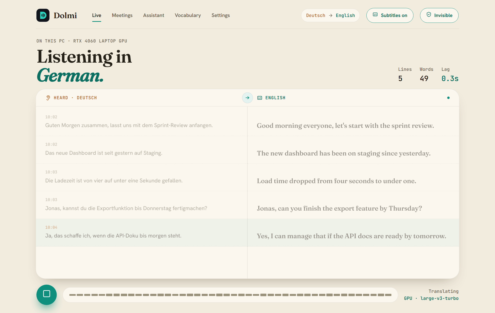
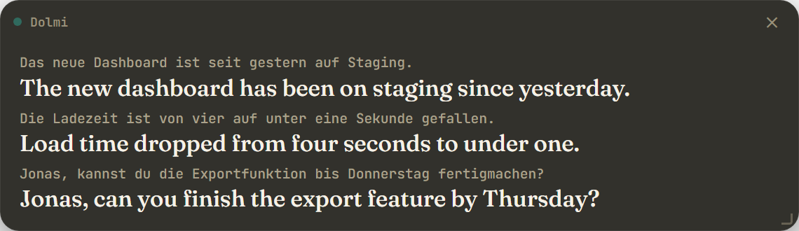
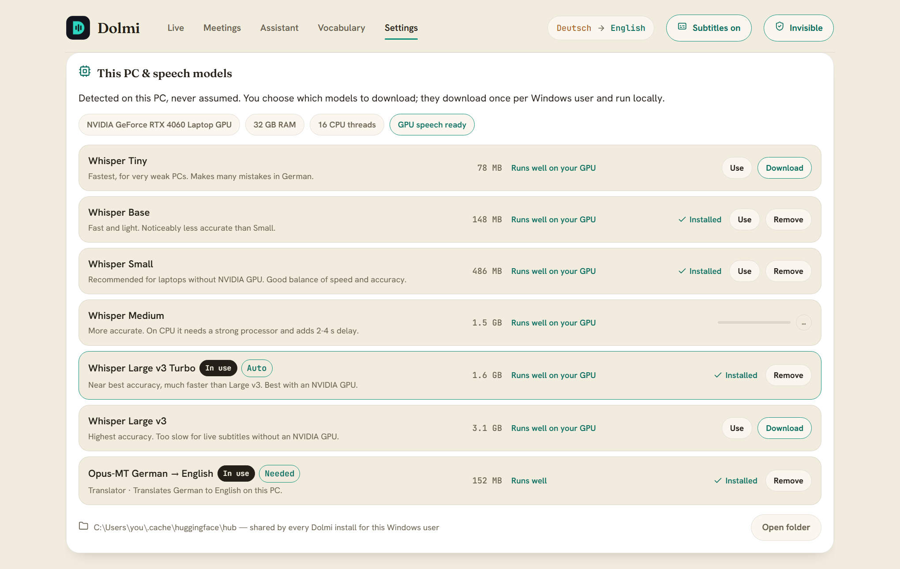
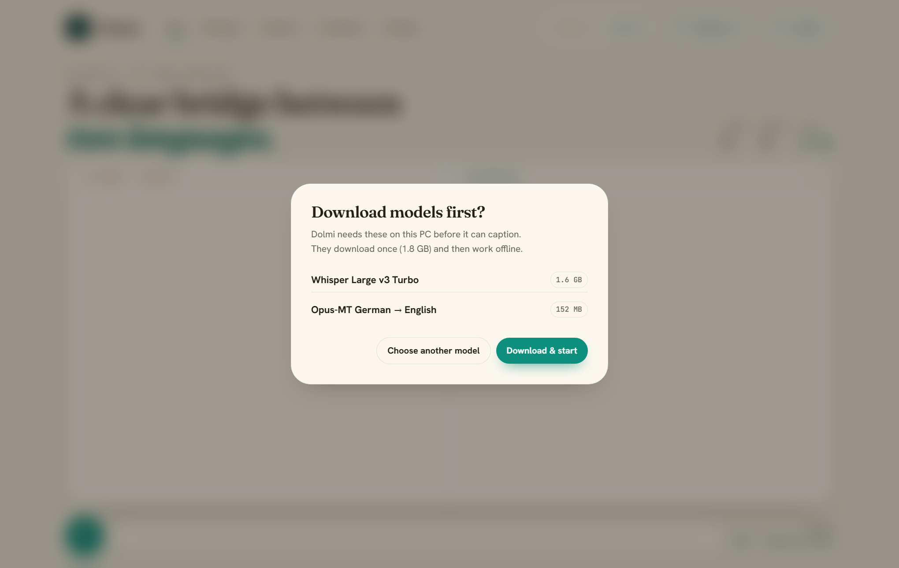
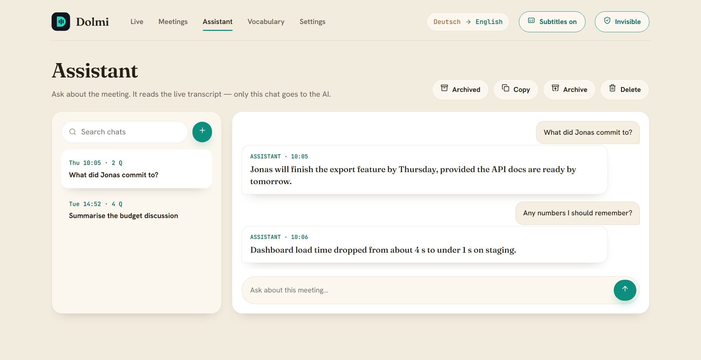

# Dolmi

**Live meeting subtitles, translated to English — private and running entirely on your Mac.**

> This is the **macOS** version. The Windows version lives in the repository root; both share the same UI, engine and features.

Dolmi listens to whatever your Mac plays (Teams, Zoom, Meet, Slack, a browser, anything), transcribes the speech, and shows a live translation in a floating subtitle bar: German speech in English, or English speech in German. Speech recognition and translation run locally and your audio never leaves your Mac; only the optional Assistant sends text to the AI provider you choose ([privacy policy](PRIVACY.md)).

> macOS 14.2 Sonoma or later, Apple Silicon. MIT licence. Build `Dolmi.app` and a `.dmg` with one command (below).



<p align="center"><em>Live view — English appears as people speak, with the original German line beside it.</em></p>



<p align="center"><em>The floating subtitle bar — open or close it with the <b>Subtitles</b> button at the top of Dolmi. Always on top, drag to move, resize from the corner, adjustable opacity and text size.</em></p>

---

## Features

- **Live subtitles** in a draggable, resizable, always-on-top bar, with the original line underneath, adjustable text size and opacity.
- **Invisible mode** — the window and subtitle bar are hidden from screen shares and recordings, and Dolmi leaves the Dock and ⌘-Tab. `⌃⌥⇧D` (Control-Option-Shift-D) turns it off from anywhere.
- **Any meeting app or browser** — Dolmi captures system audio with a Core Audio process tap, so you still hear the meeting and need no virtual audio cable (no BlackHole). A microphone works too.
- **German ↔ English** — German speech gets English subtitles (the default), English speech gets German subtitles.
- **You choose the models** — *Settings → This Mac & speech models* detects your chip, RAM and CPU cores, says how well each Whisper model runs on *this* Mac, and lets you download, switch or remove them. Nothing large downloads without asking: if Start needs a model you don't have, Dolmi shows what it needs and how big it is first.
- **Meetings** — every session saved as Markdown + SRT in both languages. Copy, archive, delete, or summarize any meeting.
- **Assistant** — ask about the meeting while it happens ("what did Jonas commit to?"). Chats are searchable, and can be copied, archived or deleted. Uses your own Claude, OpenAI, Gemini or NVIDIA key; optional.
- **Vocabulary & glossary** — teach Dolmi your names, products and terms so they're spelled and translated correctly, applied without a restart.
- **Privacy controls** — turn off saving, or auto-delete files after 7, 30 or 90 days. No account, no telemetry.
- **Proper Mac app** — `Dolmi.app` in a drag-to-Applications `.dmg`, floats over full-screen meetings on every Space, light (Paper) and dark (Ink) themes, and a UI that works fully offline.

---

## Screenshots

**This Mac & speech models** — detected hardware, how each model fits it, and one-click download, use or remove:



**Start asks before downloading** — pick another model or download the suggested one:



**Meetings** — every session in both languages, with copy, archive, delete and summarize:


**Assistant** — questions about the meeting, answered from the live transcript:



<sub>Screenshots use fictional sample meetings.</sub>

---

## Install

1. Build it (once): `./packaging/build.sh` → `dist/Dolmi-x.y.z.dmg` (needs Xcode Command Line Tools: `xcode-select --install`, and `brew install python@3.12`).
2. Open the `.dmg` and drag **Dolmi** to **Applications**.
3. The app is ad-hoc signed, not notarized, so the first time **right-click Dolmi → Open → Open** (or *System Settings → Privacy & Security → Open Anyway*).
4. Press **▶ Start**. macOS asks once to let Dolmi record **System Audio** — allow it (*System Settings → Privacy & Security → Screen & System Audio Recording → System Audio Recording Only*). If Start needs a model you don't have, Dolmi shows what it needs and how big it is first. Models download once and then work offline.

To uninstall, move Dolmi.app to the Bin. Your transcripts (`~/Documents/Dolmi`), settings (`~/Library/Application Support/Dolmi`) and models (`~/.cache/huggingface`) are kept.

### Which speech model?

| Model | Size | Good for |
|---|---|---|
| Whisper Small | 486 MB | Every Apple Silicon Mac (Auto's pick) — live with ~1–2 s delay |
| Whisper Medium | 1.5 GB | Better names and terms; adds 2–4 s; M-series Pro/Max recommended |
| Whisper Large v3 Turbo | 1.6 GB | Near-best accuracy; only Pro/Max/Ultra chips keep up live |
| Whisper Large v3 | 3.1 GB | Highest accuracy; too slow for live use on a Mac |

Whisper runs on the CPU cores (CTranslate2 with Apple Accelerate, int8); there is no GPU path on the Mac. Tiny and Base are there for older Macs. Each direction also needs a ~150 MB translator (German → English, English → German).

### Run from source

1. `brew install python@3.12` and `xcode-select --install`, then clone this repo.
2. Double-click **`Mac/start.command`** (or run it in Terminal). It creates a virtual environment, installs dependencies, builds the system-audio helper and starts Dolmi. macOS asks your terminal app for *System Audio Recording* permission on the first Start.

---

## How it works

```
App plays audio ─► Core Audio process tap (you still hear it)
                ─► Silero VAD splits on pauses
                ─► faster-whisper (speech → text, CTranslate2 int8)
                ─► Opus-MT (source language → English, CTranslate2)
                ─► floating subtitle bar  +  transcript (.md + .srt)
```

| Part | Choice |
|---|---|
| Audio capture | `audio/dolmi-audio` — Swift helper with a Core Audio process tap (macOS 14.2+); `sounddevice` for microphones |
| Speech recognition | `faster-whisper` — `small` on the CPU (Apple Accelerate), or the model you pick |
| Translation | Helsinki-NLP Opus-MT, run with CTranslate2 (no PyTorch) |
| UI | HTML/CSS in a native window (pywebview + WKWebView); the subtitle bar is a frameless, transparent webview on every Space |
| Invisible mode | `NSWindow.sharingType = none` + Dock hiding; ⌃⌥⇧D via Carbon `RegisterEventHotKey` (no Accessibility permission) |
| API keys | Encrypted with a random secret kept in the login Keychain |
| App | PyInstaller `Dolmi.app` + `.dmg` (`packaging/build.sh`), ad-hoc signed |

See [SPECS.md](SPECS.md) for the full technical details, models, languages and system requirements.

---

## Privacy

No account, no telemetry, no analytics. Speech recognition and translation run entirely on your Mac. Dolmi uses the network only for the optional Assistant and summaries (your chosen AI provider) and to download the models you choose (Hugging Face). Details: [PRIVACY.md](PRIVACY.md).

Transcribing other people processes their personal data, so tell meeting participants you are using live transcription. Dolmi shows a one-time reminder and lets you turn off saving or auto-delete old files in Settings. *(Not legal advice.)*

### Signing

Builds are ad-hoc signed, not notarized: Gatekeeper asks once (right-click → Open). Notarization needs an Apple Developer ID.

---

## Tests

```bash
cd Mac
venv/bin/python -m pytest tests/test_helpers.py
venv/bin/python tests/test_webview_bridge.py
```

The helper tests cover the transcript, vocabulary and question-detection logic. The bridge tests exercise the webview API headlessly: captions, meetings, vocabulary, chats, archive, settings, clipboard, Mac detection and model choice (including that Start never downloads without asking). Neither touches the network.

### Known macOS differences

- **Invisible mode off rebuilds the windows.** On macOS 27 a window that has been hidden from capture can't be made capturable again, so turning Invisible off swaps in a fresh window at the same place, on the same tab, with the live captions replayed. You'll see a brief flash.
- **Screen-share apps that use ScreenCaptureKit** may still capture windows on some macOS versions despite `sharingType = none`. Test with your meeting app's screen-share preview before relying on it.

---

## License

MIT — see [LICENSE](LICENSE).
