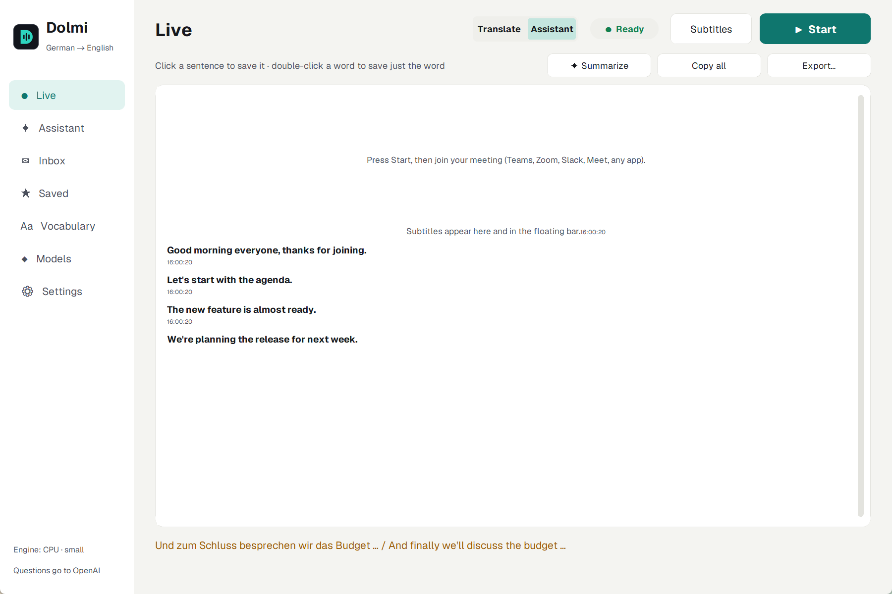
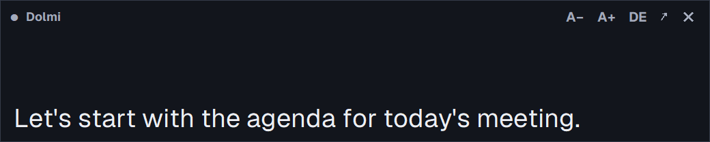
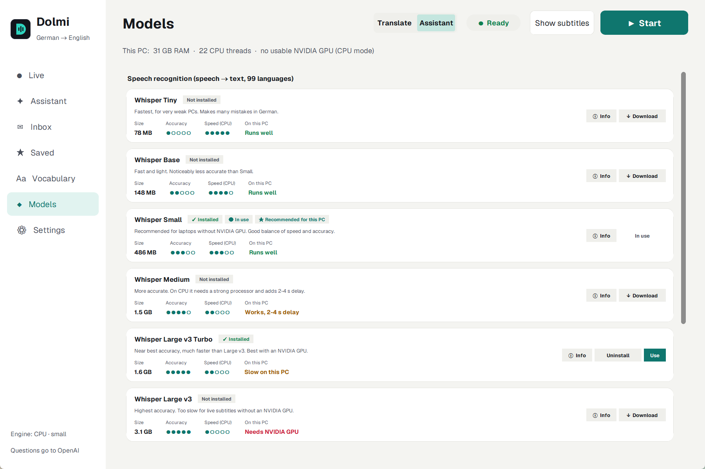
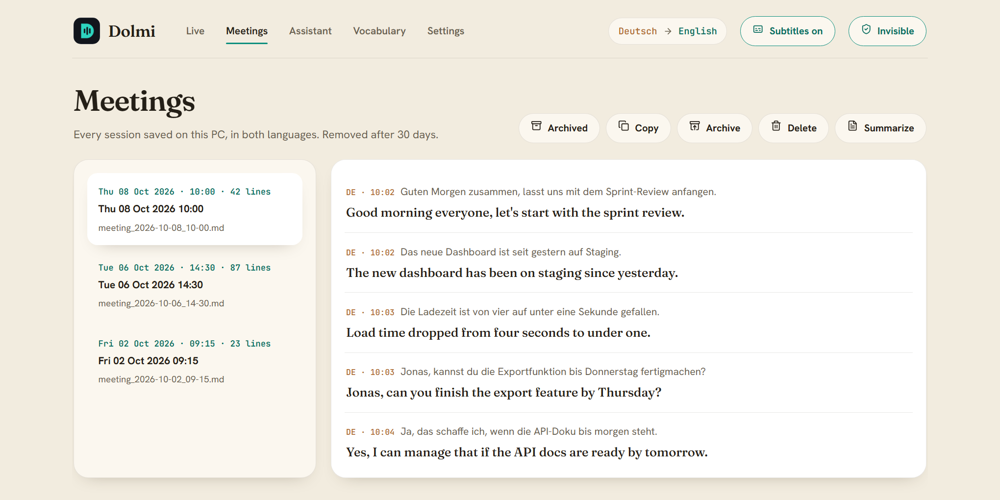

# Dolmi

**Live meeting subtitles, translated to English — private and running entirely on your PC.**

Dolmi listens to whatever plays through your speakers (Teams, Zoom, Meet, Slack, a browser, anything), transcribes the speech, and shows a live translation in a floating subtitle bar: German speech in English, or English speech in German. Speech recognition and translation run locally and your audio never leaves your PC; only the optional Assistant sends text to the AI provider you choose ([privacy policy](PRIVACY.md)).

> **On a Mac?** See [Mac/](Mac/README.md) — the same app for macOS 14.2+ (Apple Silicon).

> Windows 10 (2004+) / 11. MIT licence. [Download the installer](https://github.com/AnnasMustafaDev/dolmi/releases) — no admin rights needed.



<p align="center"><em>Live view — English appears as people speak, with the original German line beside it.</em></p>



<p align="center"><em>The floating subtitle bar — open or close it with the <b>Subtitles</b> button at the top of Dolmi. Always on top, drag to move, resize from the corner, adjustable opacity and text size.</em></p>

---

## Features

- **Live subtitles** in a draggable, resizable, always-on-top bar, with the original line underneath, adjustable text size and opacity.
- **Invisible mode** — the window and subtitle bar are hidden from screen shares, recordings and the taskbar. `Ctrl+Alt+Shift+D` turns it off.
- **Any meeting app or browser** — Dolmi captures system audio (WASAPI loopback), so you still hear the meeting and need no virtual audio cable.
- **German ↔ English** — German speech gets English subtitles (the default), English speech gets German subtitles.
- **You choose the models** — *Settings → This PC & speech models* detects your GPU, RAM and CPU, says how well each Whisper model runs on *this* PC, and lets you download, switch or remove them. Nothing large downloads without asking: if Start needs a model you don't have, Dolmi shows what it needs and how big it is first.
- **Meetings** — every session saved as Markdown + SRT in both languages. Copy, archive, delete, or summarize any meeting.
- **Assistant** — ask about the meeting while it happens ("what did Jonas commit to?"). Chats are searchable, and can be copied, archived or deleted. Uses your own Claude, OpenAI, Gemini or NVIDIA key; optional.
- **Vocabulary & glossary** — teach Dolmi your names, products and terms so they're spelled and translated correctly, applied without a restart.
- **Privacy controls** — turn off saving, or auto-delete files after 7, 30 or 90 days. No account, no telemetry.
- **Proper Windows app** — a signed-runtime installer with Start-menu shortcut, clean upgrades and uninstall, light (Paper) and dark (Ink) themes, and a UI that works fully offline.

---

## Screenshots

**This PC & speech models** — detected hardware, how each model fits it, and one-click download, use or remove:



**Start asks before downloading** — pick another model or download the suggested one:


**Meetings** — every session in both languages, with copy, archive, delete and summarize:



**Assistant** — questions about the meeting, answered from the live transcript:


<sub>Screenshots use fictional sample meetings.</sub>

---

## Install

1. Download **`Dolmi-Setup-x.y.z.exe`** from [Releases](https://github.com/AnnasMustafaDev/dolmi/releases).
2. Run it. No admin rights are needed: it installs for your user, and offers "all users" if you prefer.
3. Optional during setup: tick **GPU speech recognition** if you have an NVIDIA card (downloads about 1.3 GB). Dolmi then uses Whisper Large v3 Turbo on the GPU.
4. Open Dolmi. In *Settings → This PC & speech models*, download the model you want — or just press **▶ Start** and Dolmi offers the one that suits your PC. Models download once and then work offline.

The installer isn't code-signed yet, so Windows may show *"Windows protected your PC"*. Click **More info → Run anyway**. On PCs with **Smart App Control** turned on, unsigned installers can be blocked entirely.

Uninstall from *Settings → Apps*. Your transcripts (`Documents\Dolmi`), settings (`%APPDATA%\Dolmi`) and models are kept.

### Which speech model?

| Model | Size | Good for |
|---|---|---|
| Whisper Small | 486 MB | PCs without an NVIDIA GPU (Auto's pick) |
| Whisper Medium | 1.5 GB | Better names and terms; adds 2–4 s on a CPU |
| Whisper Large v3 Turbo | 1.6 GB | NVIDIA GPU (Auto's pick) — near-best accuracy, still fast |
| Whisper Large v3 | 3.1 GB | Highest accuracy; needs an NVIDIA GPU for live use |

Tiny and Base are there for very weak PCs. Each direction also needs a ~150 MB translator (German → English, English → German). All of them live in `%USERPROFILE%\.cache\huggingface\hub`.

### Run from source

1. Install **Python 3.12** from [python.org](https://www.python.org/downloads/) (tick *Add to PATH*), then clone this repo.
2. Double-click **`start.bat`**. It creates a virtual environment, installs dependencies, adds Desktop and Start Menu shortcuts, and starts Dolmi.

Build the installer yourself with Inno Setup 6.7+ (`winget install -e --id JRSoftware.InnoSetup`): `powershell -ExecutionPolicy Bypass -File installer\build.ps1`.

---

## How it works

```
App plays audio ─► WASAPI loopback capture (you still hear it)
                ─► Silero VAD splits on pauses
                ─► faster-whisper (speech → text, CTranslate2 int8)
                ─► Opus-MT (source language → English, CTranslate2)
                ─► floating subtitle bar  +  transcript (.md + .srt)
```

| Part | Choice |
|---|---|
| Audio capture | `pyaudiowpatch` (WASAPI loopback) |
| Speech recognition | `faster-whisper` — `small` on CPU, `large-v3-turbo` on an NVIDIA GPU, or the model you pick |
| Translation | Helsinki-NLP Opus-MT, run with CTranslate2 (no PyTorch) |
| UI | HTML/CSS in a native window (pywebview + WebView2); the subtitle bar is a frameless, transparent webview |
| Installer | Inno Setup `setup.exe` with the bundled, PSF-signed embeddable Python as the launcher (Smart App Control blocks unsigned executables) |

See [SPECS.md](SPECS.md) for the full technical details, models, languages and system requirements.

---

## Privacy

No account, no telemetry, no analytics. Speech recognition and translation run entirely on your PC. Dolmi uses the network only for the optional Assistant and summaries (your chosen AI provider), to download the models you choose (Hugging Face), and for the optional GPU add-on at setup (PyPI). Details: [PRIVACY.md](PRIVACY.md).

Transcribing other people processes their personal data, so tell meeting participants you are using live transcription. Dolmi shows a one-time reminder and lets you turn off saving or auto-delete old files in Settings. *(Not legal advice.)*

### Code signing policy

Every installer is built by GitHub Actions from a tagged commit in this repository ([release workflow](.github/workflows/release.yml)). The workflow installs, launches, upgrades and uninstalls each build before it publishes the release. Releases are **not code-signed yet**. Signing is planned through [SignPath Foundation](https://signpath.org), and this section will name the certificate once that's approved.

| Role | Who |
|---|---|
| Committers and reviewers | [Annas Mustafa](https://github.com/AnnasMustafaDev) |
| Approvers (approve each signed release) | [Annas Mustafa](https://github.com/AnnasMustafaDev) |

Dolmi never transfers information to other networked systems unless the user asks for it, as described in the [privacy policy](PRIVACY.md).

---

## Tests

```bash
venv\Scripts\python.exe -m pytest tests/test_helpers.py
venv\Scripts\python.exe tests/test_webview_bridge.py
```

The helper tests cover the transcript, vocabulary and question-detection logic. The bridge tests exercise the webview API headlessly: captions, meetings, vocabulary, chats, archive, settings and model choice (including that Start never downloads without asking). Neither touches the network.

`installer\test-install.ps1` installs, launches, upgrades and uninstalls a built `setup.exe`. It runs on GitHub's Windows runners for every release (*Actions → Installer test* runs it on demand). On a PC with Smart App Control on, it stops safely, because Windows blocks unsigned installers there.

---

## License

MIT — see [LICENSE](LICENSE).
